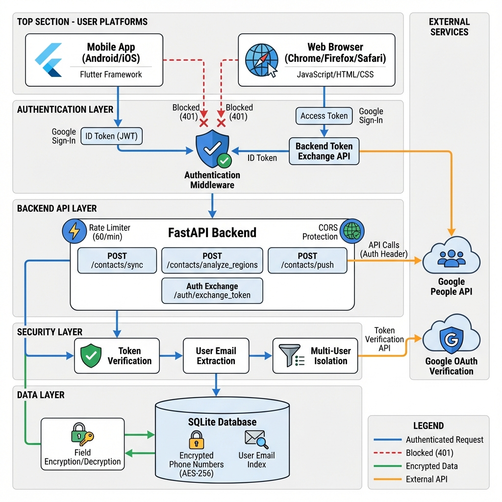

# Contact Fixer - Architecture

## Overview

Contact Fixer is a secure, multi-platform application that helps users standardize phone numbers in their Google Contacts to E.164 format. Built with Flutter (frontend) and FastAPI (backend), it features enterprise-grade security with Google OAuth authentication, field-level encryption, and multi-user support.

## System Architecture

### High-Level Components

```
┌─────────────────────┐         ┌──────────────────────┐
│  Mobile App         │         │  Web Browser         │
│  (Android/iOS)      │         │  (Chrome/Firefox)    │
│  Flutter Framework  │         │  JavaScript/HTML/CSS │
└──────────┬──────────┘         └──────────┬───────────┘
           │                               │
           │ ID Token (JWT)                │ Access Token
           │                               │
           └───────────┬───────────────────┘
                       │
              ┌────────▼─────────┐
              │  Authentication  │
              │    Middleware    │
              │   Token Verify   │
              └────────┬─────────┘
                       │
              ┌────────▼─────────┐
              │  FastAPI Backend │
              │  ┌─────────────┐ │
              │  │Rate Limiter │ │
              │  │CORS Protect │ │
              │  └─────────────┘ │
              └────────┬─────────┘
                       │
              ┌────────▼─────────┐
              │ Security Layer   │
              │ • Token Verify   │
              │ • User Extract   │
              │ • Multi-User     │
              └────────┬─────────┘
                       │
              ┌────────▼─────────┐         ┌─────────────┐
              │ SQLite Database  │◄────────┤ Encryption  │
              │ • Encrypted Data │         │  AES-256    │
              │ • User Isolation │         └─────────────┘
              └──────────────────┘
```

## Data Flow

### Version 1.2 Architecture

Contact Fixer v1.2 implements a secure, multi-platform architecture with enterprise-grade authentication and data protection.



### Authentication Flow

#### Mobile (Android/iOS)
1. User taps "Sign in with Google"
2. Google Sign-In SDK generates **ID Token (JWT)**
3. ID token sent to backend with every API request
4. Authentication Middleware verifies token with Google's public keys
5. User email extracted and request processed

#### Web (Browser)
1. User clicks "Sign in with Google"  
2. Google OAuth popup generates **Access Token**
3. Frontend calls `/auth/exchange_token` with access token
4. Backend verifies access token with Google's userinfo endpoint
5. Backend returns access token as "ID token" for subsequent requests
6. Access token sent with every API request
7. Authentication Middleware verifies via userinfo endpoint

### Security Architecture

#### Layer 1: Platform Authentication
- **Mobile**: Direct ID token from Google Sign-In SDK
- **Web**: Access token → Backend exchange → "ID token"
- Both paths validated by Google OAuth servers

#### Layer 2: Backend Middleware
- **Authentication Middleware**: Verifies all tokens (ID tokens + access tokens)
- **Rate Limiter**: 60 edits/minute per user (with visual indicator)
- **CORS Protection**: Whitelisted origins only

#### Layer 3: Data Protection
- **Field Encryption**: AES-256 Fernet encryption for sensitive data
- **Multi-User Isolation**: Filtering by authenticated user email
- **Audit Logging**: All authentication events tracked

#### Layer 4: External API Security
- **Google People API**: Calls made with user's OAuth credentials
- **OAuth Token Verification**: Backend verifies tokens with Google servers

### Data Flow Steps

1. **Authentication Request**
   ```
   User → Platform → Google OAuth → Token → Backend
   ```

2. **Token Verification**
   ```
   Backend → Authentication Middleware → Google Verification → User Email
   ```

3. **API Request Processing**
   ```
   Token Verified → User Identified → Database Query (filtered) → Response
   ```

4. **Data Storage**
   ```
   Plain Data → Field Encryption → Encrypted Storage → User Email Tagged
   ```

5. **Data Retrieval**
   ```
   User Email Filter → Encrypted Data → Field Decryption → Plain Response
   ```

### Request Flow Example: Sync Contacts

**Mobile Flow**:
```
1. Mobile app: googleSignIn.signIn() → ID Token
2. API call: POST /contacts/sync with "Authorization: Bearer <ID_TOKEN>"
3. Middleware: Verify ID token → Extract email → Proceed
4. Backend: Fetch from Google People API → Encrypt → Save with user_email
5. Response: {status: "success", synced_count: 684}
```

**Web Flow**:
```
1. Web app: googleSignIn.signIn() → Access Token
2. Exchange: POST /auth/exchange_token {access_token: "<TOKEN>"}
3. Backend: Verify with Google userinfo → Return access token
4. API call: POST /contacts/sync with "Authorization: Bearer <ACCESS_TOKEN>"
5. Middleware: Verify access token via userinfo → Extract email → Proceed
6. Backend: Fetch from Google People API → Encrypt → Save with user_email
7. Response: {status: "success", synced_count: 684}
```

### Security Guarantees

✅ **Authentication**: Every protected endpoint requires valid Google token  
✅ **Authorization**: Users can only access their own data  
✅ **Encryption**: All sensitive data encrypted at rest (AES-256)  
✅ **Rate Limiting**: Protection against abuse (60 req/min)  
✅ **Audit Trail**: All security events logged  
✅ **CORS Protection**: Controlled cross-origin access

## Technology Stack

### Frontend
- **Framework**: Flutter 3.0+
- **State Management**: Provider pattern
- **HTTP Client**: http package
- **Authentication**: google_sign_in (v6)
  - Mobile: Direct ID token generation
  - Web: Access token with backend exchange
- **UI Components**: Material Design 3 + Custom Neumorphic System
  - `flutter_card_swiper` for gestures
  - `google_fonts` for typography

### Backend
- **Framework**: FastAPI (Python)
- **Database**: SQLite with field-level encryption
- **Authentication**: Google OAuth 2.0 token verification
- **Security**: 
  - Cryptography (Fernet) for encryption
  - SlowAPI for rate limiting
  - CORS middleware
- **External APIs**: Google People API

### Security Stack
- **Encryption**: AES-256 (Fernet)
- **Token Verification**: Google OAuth public keys + userinfo endpoint
- **Rate Limiting**: SlowAPI with in-memory storage
- **Audit Logging**: Python logging with rotation

## Database Schema

### Contacts Table (Encrypted)
```sql
CREATE TABLE contacts (
    id INTEGER PRIMARY KEY,
    user_email TEXT NOT NULL,  -- For multi-user isolation
    resource_name TEXT NOT NULL,
    display_name TEXT,
    phone_number TEXT,  -- ENCRYPTED with Fernet
    parsed_region TEXT,
    needs_fix BOOLEAN,
    raw_json TEXT,  -- ENCRYPTED with Fernet
    created_at TIMESTAMP DEFAULT CURRENT_TIMESTAMP,
    updated_at TIMESTAMP DEFAULT CURRENT_TIMESTAMP
);

CREATE INDEX idx_user_email ON contacts(user_email);
CREATE INDEX idx_needs_fix ON contacts(needs_fix WHERE needs_fix = 1);
```

### Pending Changes Table (Encrypted)
```sql
CREATE TABLE pending_changes (
    id INTEGER PRIMARY KEY,
    user_email TEXT NOT NULL,  -- For multi-user isolation
    resource_name TEXT NOT NULL,
    display_name TEXT,
    old_phone TEXT,  -- ENCRYPTED
    new_phone TEXT,  -- ENCRYPTED
    status TEXT DEFAULT 'pending',
    created_at TIMESTAMP DEFAULT CURRENT_TIMESTAMP
);

CREATE INDEX idx_pending_user ON pending_changes(user_email, status);
```

## API Endpoints

### Authentication
- `POST /auth/exchange_token` - Exchange web access_token for ID token

### Contacts Management
- `POST /contacts/sync` - Sync contacts from Google (authenticated)
- `GET /contacts/missing_extension?region={code}` - Get contacts needing fixes (authenticated)
- `POST /contacts/analyze_regions` - Analyze contact regions (authenticated)
- `GET /contacts/pending_changes` - Get pending changes (authenticated)
- `POST /contacts/push` - Push changes to Google (authenticated)

### Staging
- `POST /contacts/stage` - Stage a contact fix (authenticated)
- `DELETE /contacts/stage/{id}` - Remove staged change (authenticated)
- `POST /contacts/clear_staged` - Clear all staged changes (authenticated)

All endpoints (except `/auth/exchange_token`) require `Authorization: Bearer <token>` header.

## Security Model

### Authentication Flow
1. **Token Generation**:
   - Mobile: Google Sign-In SDK → ID Token (JWT)
   - Web: Google OAuth → Access Token → Backend Exchange → "ID Token"

2. **Token Verification**:
   - ID Tokens: Verified with Google's public keys
   - Access Tokens: Verified via Google userinfo endpoint

3. **User Identification**:
   - Email extracted from verified token
   - All database queries filtered by `user_email`

### Data Protection
- **At Rest**: AES-256 Fernet encryption for sensitive fields
- **In Transit**: HTTPS (production)
- **Access Control**: Per-user data isolation via email filtering

### Rate Limiting
- 60 requests per minute per user
- Keyed by user email from authenticated token
- Returns 429 Too Many Requests when exceeded

### Audit Logging
- All authentication attempts logged
- Failed auth attempts tracked
- Security events in separate log file (`backend/logs/security.log`)

## Deployment Architecture

### Development
```
Mobile/Web Client → localhost:8000 (Backend) → SQLite DB
                       ↓
                 Google APIs (OAuth + People)
```

### Production
```
Mobile/Web Client → HTTPS Load Balancer
                       ↓
                 Reverse Proxy (Nginx/Caddy)
                       ↓
                 FastAPI Backend (Gunicorn)
                       ↓
                 SQLite DB (encrypted volume)
                       ↓
                 Google APIs (OAuth + People)
```

## Performance Considerations

- **Database**: SQLite with indexes on `user_email` and `needs_fix`
- **Caching**: Token verification results cached per request
- **Rate Limiting**: In-memory storage for rate limit counters
- **Encryption**: Field-level only (not full-disk) for performance

## Scalability

Current architecture supports:
- **Users**: Hundreds to low thousands
- **Contacts per user**: Up to 10,000
- **Requests**: 60/min per user

For larger scale:
- Migrate to PostgreSQL
- Add Redis for caching and rate limiting
- Implement connection pooling
- Add CDN for static assets

---

**For deployment guide, see** [`docs/SECURITY.md`](SECURITY.md)  
**For setup instructions, see** [`docs/SETUP_GUIDE.md`](SETUP_GUIDE.md)
