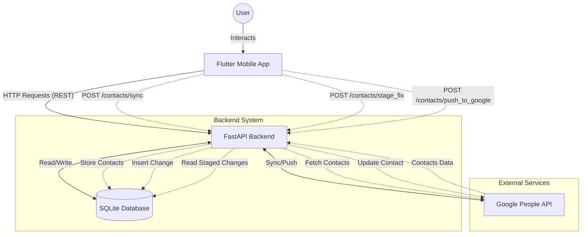

# Contact Fixer Architecture

## Overview
Contact Fixer is a mobile application designed to standardize phone number formats in a user's Google Contacts using the E.164 international format.

## Tech Stack

### Mobile App (Frontend)
- **Framework**: Flutter (Dart)
- **Platform Support**: Android & iOS
- **Authentication**: Native Google Sign-In (`google_sign_in` v6)
- **State Management**: Provider pattern
- **Role**: Handles UI, User Authentication, and displaying contacts

### Backend (Logic Layer)
- **Language**: Python 3.x
- **Framework**: FastAPI
- **Communication**: REST API (JSON)
- **Capabilities**:
    - **Google Auth**: OAuth 2.0 Flow
    - **Contact Sync**: One-way fetch from Google to Local DB
    - **Fixing Logic**: Analyzes and standardizes phone numbers using `libphonenumber`
    - **Write-Back**: Supports creating and updating contacts on Google
    - **Data Consistency**: 
        - **Write-Through Caching**: Modifications immediately update local SQLite database
        - **Robust Updates (Pre-Fetch)**: Fetches latest `etag` before updates to prevent conflicts

## Project Structure
```
Contact_Fixer/
├── backend/                 # Python API Source
│   ├── main.py              # Entry point (FastAPI)
│   ├── routers/             # API route handlers
│   │   ├── auth.py          # Authentication endpoints
│   │   └── contacts.py      # Contact management endpoints
│   └── services/            # Business logic
│       ├── auth_service.py  # OAuth 2.0 handling
│       ├── contact_service.py # Contact operations
│       └── db_service.py    # SQLite database
├── frontend/                # Mobile App Source (Flutter)
│   └── lib/
│       ├── main.dart        # App Entry point
│       ├── models/          # Data models
│       │   └── country.dart
│       ├── providers/       # State management
│       │   ├── auth_provider.dart
│       │   ├── contacts_provider.dart
│       │   └── settings_provider.dart
│       ├── services/        # API client
│       │   └── api_service.dart
│       ├── widgets/         # Shared widgets
│       │   └── region/
│       │       ├── country_picker_sheet.dart
│       │       └── region_selector_button.dart
│       └── screens/         # UI pages
│           ├── login_screen.dart
│           ├── home_screen.dart
│           ├── home/
│           │   └── widgets/  # Home-specific widgets
│           ├── contacts_preview_screen.dart
│           ├── contacts_preview/
│           │   └── widgets/
│           ├── phone_fixer_screen.dart
│           └── phone_fixer/
│               ├── views/    # View mode components
│               │   ├── swipe_view_mode.dart
│               │   └── list_view_mode.dart
│               ├── widgets/  # Screen-specific widgets
│               │   ├── contact_card.dart
│               │   ├── control_toolbar.dart
│               │   ├── stat_chip.dart
│               │   ├── empty_state.dart
│               │   ├── summary_card.dart
│               │   └── change_card.dart
│               ├── dialogs/  # Dialog components
│               │   ├── edit_contact_dialog.dart
│               │   └── edit_pending_dialog.dart
│               ├── utils/    # Utility functions
│               │   └── phone_fixer_utils.dart
│               └── pending_changes_screen.dart
├── docs/                    # Project Documentation
├── venv/                    # Python Virtual Environment
└── .gitignore               # Git Configuration
```

## Authentication Flow

### Mobile App (Frontend)
1. User taps "Sign in with Google"
2. Native Google Sign-In popup appears
3. User selects Google account
4. App receives user info (name, email)
5. App is now authenticated for UI

### Backend (Server-Side)
1. Backend loads `backend/credentials.json` (Client Secret)
2. First API call triggers browser OAuth flow on server
3. Access/Refresh tokens stored in `backend/token.json`
4. Subsequent calls use stored tokens

**Security**: Both JSON files are git-ignored to prevent credential leaks.

## Data Flow


## Documentation Index
- [Function Documentation](FUNCTION_DOCUMENTATION.md) - Details on Python functions
- [API Reference](API_REFERENCE.md) - HTTP Endpoints
- [Frontend Documentation](FRONTEND_DOCUMENTATION.md) - Flutter App details

## Development Workflow

### Backend
```bash
cd Contact_Fixer
source venv/bin/activate
uvicorn backend.main:app --reload --host 0.0.0.0
```

### Frontend
```bash
cd Contact_Fixer/frontend
flutter pub get
flutter run
```

## Google Cloud Console Setup
1. Create OAuth 2.0 credentials (Android + Web client IDs)
2. Configure OAuth consent screen with app name
3. Add test users for apps in "Testing" mode
4. Enable required APIs: People API, Identity Toolkit API
