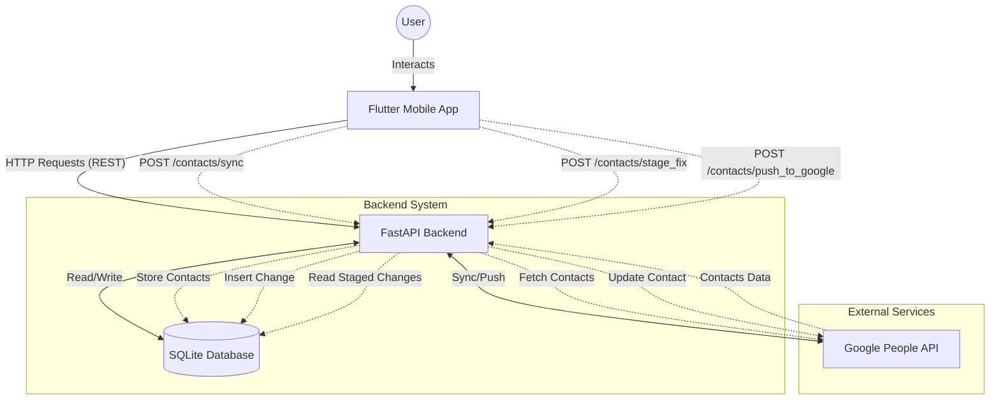

# Contact Fixer Architecture

## Overview
Contact Fixer is a **security-hardened** mobile application designed to standardize phone number formats in a user's Google Contacts using the E.164 international format. Features enterprise-grade security with encryption, authentication, and multi-user support.

## Tech Stack

### Frontend (Mobile & Web)
- **Framework**: Flutter (Dart)
- **Platform Support**: Android, iOS, Web (Chrome)
- **Authentication**: 
  - Native Google Sign-In (`google_sign_in` v6.2.1)
  - Web: Legacy popup authentication (FedCM disabled for Testing mode compatibility)
  - Platform-aware configuration in `index.html`
  - **Security**: Google ID tokens sent with every API request
- **State Management**: Provider pattern with `AuthProvider` for token management
- **Platform-Aware Features**:
  - Automatic API URL detection (localhost for web, 10.0.2.2 for Android emulator)
  - Locale detection with web compatibility
- **Role**: Handles UI, User Authentication (Google Sign-In), and displaying contacts

### Backend (Logic Layer)
- **Language**: Python 3.x
- **Framework**: FastAPI
- **Communication**: REST API (JSON)
- **Security**:
  - **Authentication**: Google ID token verification on all endpoints
  - **Encryption**: Field-level encryption (Fernet/AES-256) for sensitive data
  - **Rate Limiting**: Per-user and per-IP throttling (default: 60 req/min)
  - **Input Validation**: Strict Pydantic models with regex patterns
  - **CORS**: Restricted to `localhost:3000` (configurable via `.env`)
  - **Security Headers**: X-Frame-Options, X-XSS-Protection, HSTS (production)
  - **Audit Logging**: Security event logging for compliance
- **Capabilities**:
    - **Google Auth**: OAuth 2.0 Flow (backend-side for server credentials)
    - **Token Verification**: Validates Google ID tokens from Flutter app
    - **Contact Sync**: One-way fetch from Google to Local DB (per-user)
    - **Fixing Logic**: Analyzes and standardizes phone numbers using `libphonenumber`
    - **Write-Back**: Supports creating and updating contacts on Google
    - **Multi-User Support**: Complete data isolation between users
    - **Data Consistency**: 
        - **Write-Through Caching**: Modifications immediately update local SQLite database
        - **Robust Updates (Pre-Fetch)**: Fetches latest `etag` before updates to prevent conflicts
        - **Encrypted Storage**: All sensitive fields encrypted at rest

## Project Structure
```
Contact_Fixer/
├── .env                     # Environment variables (NOT in git)
├── .env.example             # Environment template
├── backend/                 # Python API Source
│   ├── main.py              # Entry point (FastAPI with security middleware)
│   ├── core/                # Core security infrastructure
│   │   ├── config.py        # Environment configuration
│   │   ├── security.py      # Token verification, encryption
│   │   └── logging_config.py # Security logging
│   ├── middleware/          # Security middleware
│   │   ├── auth_middleware.py # Google ID token verification
│   │   └── rate_limit.py    # Rate limiting
│   ├── migrations/          # Database migrations
│   │   └── migrate_to_secure.py # Security migration script
│   ├── routers/             # API route handlers (all protected)
│   │   ├── auth.py          # Authentication endpoints
│   │   └── contacts.py      # Contact management endpoints
│   └── services/            # Business logic
│       ├── auth_service.py  # OAuth 2.0 handling
│       ├── contact_service.py # Contact operations
│       └── db_service.py    # SQLite database with encryption
├── frontend/                # Mobile App Source (Flutter)
│   └── lib/
│       ├── main.dart        # App Entry point
│       ├── mixins/          # Helper mixins
│       │   └── auth_token_mixin.dart # Auth token helper
│       ├── models/          # Data models
│       │   └── country.dart
│       ├── providers/       # State management
│       │   ├── auth_provider.dart      # Google Sign-In + token management
│       │   ├── contacts_provider.dart  # With authentication
│       │   └── settings_provider.dart
│       ├── services/        # API client
│       │   └── api_service.dart        # With auth headers
├── frontend/                # Mobile App Source (Flutter)
│   └── lib/
│       ├── main.dart        # App Entry point
│       ├── models/          # Data models
│       │   └── country.dart
│       ├── providers/       # State management
│       │   ├── auth_provider.dart
│       │   ├── contacts_provider.dart
│       │   └── settings_provider.dart
│       ├── services/        # API client
│       │   └── api_service.dart
│       ├── widgets/         # Shared widgets
│       │   └── region/
│       │       ├── country_picker_sheet.dart
│       │       └── region_selector_button.dart
│       └── screens/         # UI pages
│           ├── login_screen.dart
│           ├── home_screen.dart
│           ├── home/
│           │   └── widgets/  # Home-specific widgets
│           ├── contacts_preview_screen.dart
│           ├── contacts_preview/
│           │   └── widgets/
│           ├── phone_fixer_screen.dart
│           └── phone_fixer/
│               ├── views/    # View mode components
│               │   ├── swipe_view_mode.dart
│               │   └── list_view_mode.dart
│               ├── widgets/  # Screen-specific widgets
│               │   ├── contact_card.dart
│               │   ├── control_toolbar.dart
│               │   ├── stat_chip.dart
│               │   ├── empty_state.dart
│               │   ├── summary_card.dart
│               │   └── change_card.dart
│               ├── dialogs/  # Dialog components
│               │   ├── edit_contact_dialog.dart
│               │   └── edit_pending_dialog.dart
│               ├── utils/    # Utility functions
│               │   └── phone_fixer_utils.dart
│               └── pending_changes_screen.dart
├── docs/                    # Project Documentation
├── venv/                    # Python Virtual Environment
└── .gitignore               # Git Configuration
```

## Authentication Flow

### Frontend (Mobile & Web)
1. User clicks "Sign in with Google"
2. **Mobile**: Native popup appears.
3. **Web**: Google Sign-In popup/redirect appears (requires `google-signin-client_id` meta tag).
4. User selects Google account
5. App receives user info (name, email)
6. App is now authenticated for UI

### Backend (Server-Side)
1. Backend loads `backend/credentials.json` (Client Secret)
2. First API call triggers browser OAuth flow on server
3. Access/Refresh tokens stored in `backend/token.json`
4. Subsequent calls use stored tokens

**Security**: Both JSON files are git-ignored to prevent credential leaks.

## Data Flow


## Documentation Index
- [Function Documentation](FUNCTION_DOCUMENTATION.md) - Details on Python functions
- [API Reference](API_REFERENCE.md) - HTTP Endpoints
- [Frontend Documentation](FRONTEND_DOCUMENTATION.md) - Flutter App details

## Development Workflow

### Backend
```bash
cd Contact_Fixer
source venv/bin/activate
uvicorn backend.main:app --reload --host 0.0.0.0
```

### Frontend
```bash
cd Contact_Fixer/frontend
flutter pub get
flutter run
```

## Google Cloud Console Setup
1. Create OAuth 2.0 credentials (Android + Web client IDs)
2. Configure OAuth consent screen with app name
3. Add test users for apps in "Testing" mode
4. Enable required APIs: People API, Identity Toolkit API
