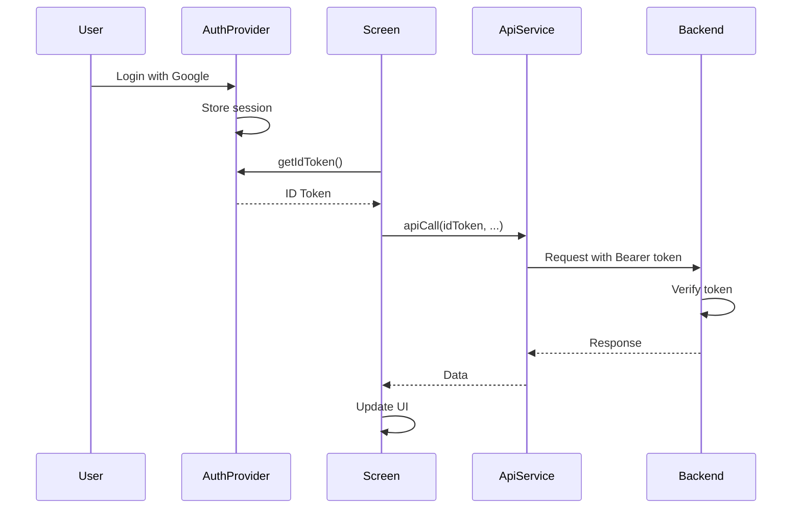

# Frontend Authentication Integration Guide

## ✅ Status: 100% Complete

Frontend authentication integration is **fully complete**. All screens properly pass ID tokens to API endpoints.

## Implementation Summary

- **`AuthProvider`** - Provides `getIdToken()` method for all screens
- **`ApiService`** - All methods accept `idToken` parameter  
- **`AuthTokenMixin`** - Reusable mixin for easy token retrieval
- **`ContactsProvider`** - Fully integrated with authentication
- **All screens** - Using `AuthTokenMixin` and passing tokens correctly

---

## ⚠️ Rate Limiting Considerations

The backend enforces **100 edits per minute per user** for most endpoints. The app includes a visual indicator that appears after 75% usage, showing:
- Real-time countdown to next available edit
- Current usage percentage with color coding
- Number of remaining edits

### ✅ Safe Operations (Single API Call)

These operations use **bulk/batch endpoints** and are safe from rate limiting:

1. **Delete All** (`/contacts/staged` DELETE)
   - Clears all staged changes in one database operation
   - Rate limit: 10 requests/minute
   - Located in: `pending_changes_screen.dart`

2. **Push to Google** (`/contacts/push` POST)
   - Pushes all staged changes in one request
   - Rate limit: 10 requests/minute  
   - Located in: `pending_changes_screen.dart`

3. **Get Pending Changes** (`/contacts/pending` GET)
   - Retrieves all pending changes in one call
   - Rate limit: 60 requests/minute

4. **Get Missing Extension Contacts** (`/contacts/missing_extension` GET)
   - Retrieves all contacts needing extension in one call
   - Rate limit: 60 requests/minute

### ❌ Disabled Features (Rate Limit Risk)

**Accept All Button** - Currently disabled to prevent rate limit issues

The "Accept All" feature was making individual `/contacts/stage_fix` API calls in a loop for each contact. With large contact lists (100+ contacts), this would immediately exceed the 60 requests/minute limit.

**Status**: Disabled and commented out in `control_toolbar.dart`  
**Future**: Will be re-implemented as a premium feature using a batch API endpoint

```dart
// control_toolbar.dart - Lines 31-47
// Accept All Button - DISABLED (Premium Feature - Coming Soon)
// Disabled due to rate limiting concerns (60 requests/minute)
// Future implementation will use batch API endpoint
/* 
ElevatedButton.icon(
  onPressed: contactCount > 0 ? onAcceptAll : null,
  icon: const Icon(Icons.done_all, size: 18),
  label: const Text('Accept All'),
  ...
),
*/
```

### 🛡️ Best Practices for Rate Limiting

The app now includes a **visual rate limit indicator** that:
- Appears automatically when you've used >75% of your quota
- Shows real-time countdown to next available edit
- Color-codes urgency: Amber (75-80%) → Orange (80-99%) → Red (100%)
- Updates every 500ms for smooth countdown animation

When implementing new features:

1. **Use bulk endpoints** whenever possible
2. **Avoid loops** that make individual API calls
3. **Batch operations** into single API requests
4. **Monitor the visual indicator** - it provides real-time feedback
5. **Check rate limits** in `backend/routers/contacts.py`:
   ```python
   @limiter.limit("100/minute")  # Default limit (increased from 60)
   @limiter.limit("10/minute")   # For sensitive operations
   ```

6. **Handle rate limit errors gracefully**:
   ```dart
   try {
     await _api.someOperation(idToken);
   } catch (e) {
     if (e.toString().contains('429')) {
       showSnackBar('At capacity - please wait for edits to refresh');
     }
   }
   ```

**Note**: The visual indicator provides proactive feedback, so users rarely hit actual 429 errors.

---

## Implementation Pattern

All screens follow this consistent pattern using `AuthTokenMixin`:

```dart
import 'package:flutter/material.dart';
import '../mixins/auth_token_mixin.dart';
import '../services/api_service.dart';

class MyScreen extends StatefulWidget {
  @override
  State<MyScreen> createState() => _MyScreenState();
}

class _MyScreenState extends State<MyScreen> with AuthTokenMixin {
  late final ApiService _api;
  
  @override
  void initState() {
    super.initState();
    // Create API service with authentication callback
    _api = createApiService(context);
    _loadData();
  }
  
  Future<void> _loadData() async {
    try {
      // Get ID token
      final idToken = await getIdToken(context);
      
      // Pass token to API call
      final result = await _api.someMethod(idToken);
      
      // Handle result
      setState(() {
        // Update state
      });
    } catch (e) {
      // Handle error
    }
  }
}
```

### Key Points

1. **Mix in `AuthTokenMixin`** to get helper methods
2. **Use `createApiService(context)`** to initialize API service with auth callback
3. **Call `getIdToken(context)`** before each API request
4. **Pass `idToken`** to all API methods

---

## Completed Screens

All screens have been updated with authentication:

### 1. ✅ `phone_fixer_screen.dart`
- Uses `AuthTokenMixin`
- Passes tokens to:
  - `getPendingChanges(idToken)`
  - `getMissingExtensionContacts(idToken: idToken, regionCode: ...)`
  - `stageFix(idToken: idToken, ...)`

### 2. ✅ `pending_changes_screen.dart`  
- Uses `AuthTokenMixin`
- Passes tokens to:
  - `getPendingChanges(idToken)`
  - `pushToGoogle(idToken)`
  - `stageFix(idToken: idToken, ...)`
  - `clearStaged(idToken)`
  - `removeStagedChange(idToken, resourceName)`

### 3. ✅ `settings_provider.dart`
- Injects `AuthProvider` via constructor
- Passes tokens to:
  - `analyzeRegions(idToken)`

### 4. ✅ `country_picker_sheet.dart`
- Uses `AuthTokenMixin`
- Passes tokens to:
  - `analyzeRegions(idToken)`

### 5. ✅ `main.dart`
- Properly injects `AuthProvider` into `SettingsProvider`
- Uses `ChangeNotifierProxyProvider` for reactive updates

---

## Authentication Flow



---

## Testing Authentication

### Manual Testing

1. **Sign in with Google**
   - Verify authentication works
   - Check that user info appears in UI

2. **Make API calls**
   - Load contacts
   - Stage changes
   - Push to Google

3. **Test authentication expiry**
   - Wait for token to expire (1 hour)
   - Verify user is logged out automatically

4. **Test without authentication**
   - Sign out
   - Verify protected screens redirect to login

### Common Issues

See [TROUBLESHOOTING.md](TROUBLESHOOTING.md) for authentication-related issues.

---

## Security Notes

- **Never log ID tokens** in production
- **Tokens expire after 1 hour** - handled automatically by `AuthProvider`
- **All endpoints require authentication** except login
- **Rate limiting protects against abuse**
- **Multi-user data isolation** is enforced server-side

---

**Last Updated**: 2026-01-07  
**Version**: 1.2.1
